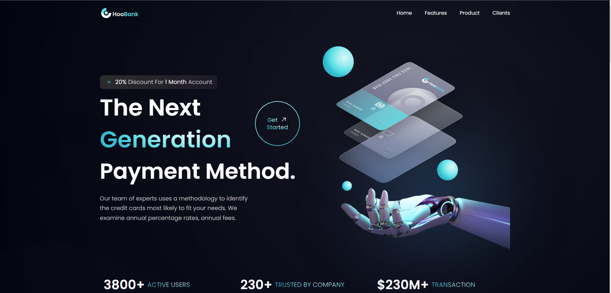
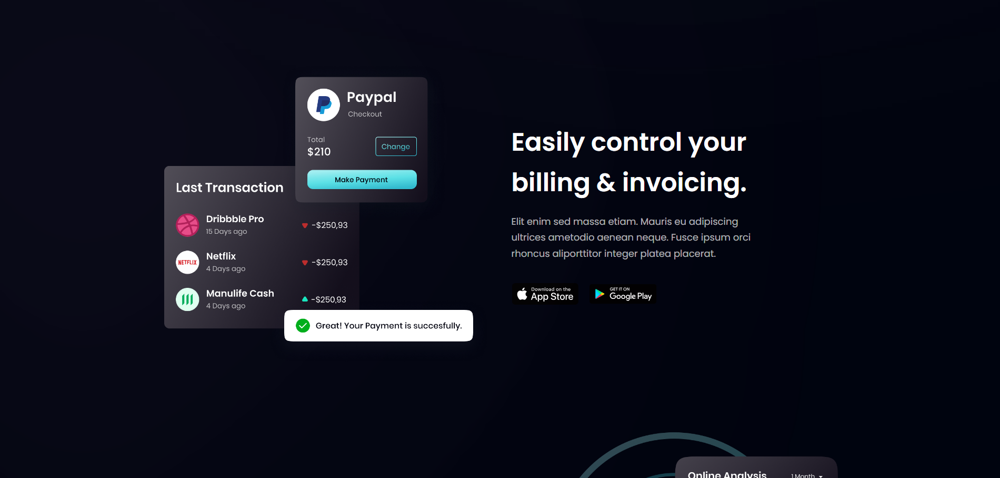
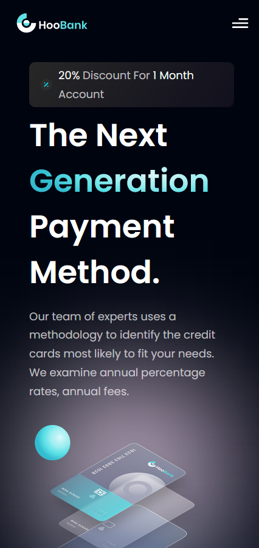

# Fully responsive Fintech landing page

Shout out to Javascript Mastery for the guidance (https://www.jsmastery.pro/)

Figma (Designed by oneweekwonders) : https://www.figma.com/file/bUGIPys15E78w9bs1l4tgS/HooBank?node-id=310%3A485

# Screen Previews

# Medium and Large screens

# Mobile and small screens

